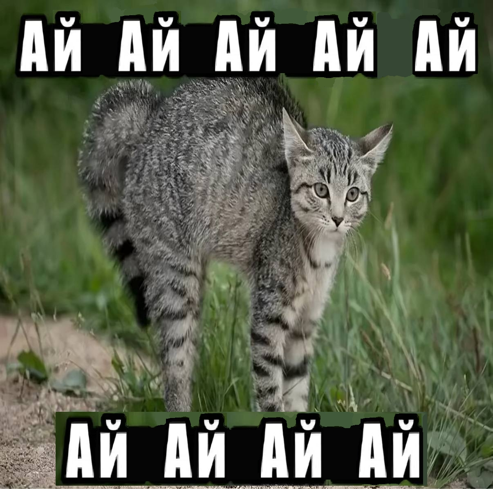

<h1 align="center"><i>~привет, видел тебя сегодня в колледже ᄽ●・●ᄿ</i></h1>

  <table align="center">
    <tr>
      <td align="center">
        
      </td>
      <td align="center">
        
      </td>
      <td align="center">
        
      </td>
    </tr>
  </table>

  

<h2 align="center"><i>~стек (＝⌒▽⌒＝)</i></h2>

  

<!-- Языки -->

  <h3><i>~языки (ღ˘⌣˘ღ)</i></h3>
  <table align="center">
    <tr>
      <td align="center" style="padding: 0 10px;">
        
      </td>
      <td align="center" style="padding: 0 10px;">
        
      </td>
      <td align="center" style="padding: 0 10px;">
        
      </td>
      <td align="center" style="padding: 0 10px;">
        
      </td>
      <td align="center" style="padding: 0 10px;">
        
      </td>
    </tr>
  </table>

<!-- Фреймворки -->

  <h3><i>~фреймворки (。・ω・。)</i></h3>
  <table align="center">
    <td align="center" style="padding: 0 10px;">
      
    </td>
    <td align="center" style="padding: 0 10px;">
      
    </td>
    <td align="center" style="padding: 0 10px;">
      
    </td>
    <td align="center" style="padding: 0 10px;">
      
    </td>
    <td align="center" style="padding: 0 10px;">
      
    </td>
  </table>

<!-- Технологии -->

  <h3><i>~технологии (｡･ω･｡)ﾉ♡</i></h3>
  <table align="center">
    <td align="center" style="padding: 0 10px;">
      
    </td>
    <td align="center" style="padding: 0 10px;">
      
    </td>
    <td align="center" style="padding: 0 10px;">
      
    </td>
    <td align="center" style="padding: 0 10px;">
      
    </td>
    <td align="center" style="padding: 0 10px;">
      
    </td>
    <td align="center" style="padding: 0 10px;">
      
    </td>
    <td align="center" style="padding: 0 10px;">
      
    </td>
    <td align="center" style="padding: 0 10px;">
      
    </td>
    <td align="center" style="padding: 0 10px;">
      
    </td>
  </table>

<!-- СУБД и инструменты -->

  <h3><i>~СУБД и инструменты ʕ≧ᴥ≦ʔ</i></h3>
  <table align="center">
    <td align="center" style="padding: 0 10px;">
      
    </td>
    <td align="center" style="padding: 0 10px;">
      
    </td>
    <td align="center" style="padding: 0 10px;">
      
    </td>
    <td align="center" style="padding: 0 10px;">
      
    </td>
    <td align="center" style="padding: 0 10px;">
      
    </td>
    <td align="center" style="padding: 0 10px;">
      
    </td>
    <td align="center" style="padding: 0 10px;">
      
    </td>
    <td align="center" style="padding: 0 10px;">
      
    </td>
    <td align="center" style="padding: 0 10px;">
      
    </td>
  </table>

  

<h2 align="center"><i>~гитхаб~статка (^=◕ᴥ◕=^)</i></h2>

  

  <h3><i>~общее (^._.^)ﾉ</i></h3>
  
  

  <h3><i>~бомбочки прокидывают щебенёнки... (╯‵□′)╯Boom！•••*～●</i></h3>

<picture>
  <source media="(prefers-color-scheme: dark)" srcset="https://raw.githubusercontent.com/MindlessMuse666/MindlessMuse666/pacman-output/bomberman-contribution-graph-dark.svg">
  <source media="(prefers-color-scheme: light)" srcset="https://raw.githubusercontent.com/MindlessMuse666/MindlessMuse666/pacman-output/bomberman-contribution-graph.svg">
  
</picture>

  <h3><i>~бомбочки прокидывают щебенёнки... (╯‵□′)╯Boom！•••*～●</i></h3>

  
  <h3><i>~сток ミクшников уже посмотрело (〃￣ω￣〃ゞ</i></h4>

