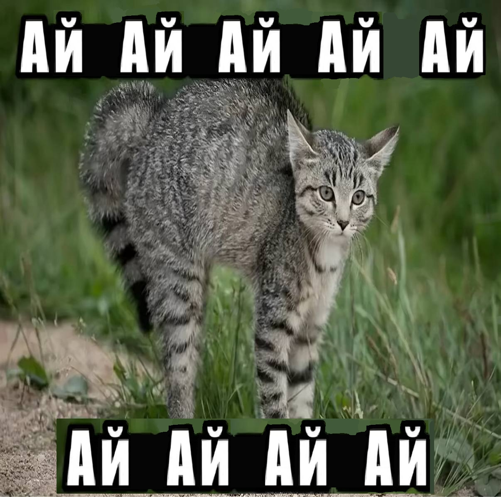

  

  

  

  

<table align="center">
  <tr>
    <td align="center" colspan="2"><b>💼 Обо мне</b></td>
  </tr>
  <tr>
    <td>👨‍💻</td>
    <td>Web-разработчик (fullstack)</td>
  </tr>
  <tr>
    <td>💼</td>
    <td>Работаю в системной аналитике</td>
  </tr>
  <tr>
    <td>🐳</td>
    <td>Практикую архитектуру ПО</td>
  </tr>
  <tr>
    <td>🎨</td>
    <td>Создаю игры, пишу музыку</td>
  </tr>
</table>

  

  

<table align="center">
  <tr>
    <td></td>
    <td></td>
    <td></td>
    <td></td>
    <td></td>
  </tr>
</table>

 

  

<table align="center">
  <tr>
    <td></td>
    <td></td>
    <td></td>
    <td></td>
    <td></td>
  </tr>
</table>

 

  

<table align="center">
  <tr>
    <td></td>
    <td></td>
    <td></td>
    <td></td>
    <td></td>
    <td></td>
    <td></td>
    <td></td>
    <td></td>
  </tr>
</table>

 

  

<table align="center">
  <tr>
    <td></td>
    <td></td>
    <td></td>
    <td></td>
    <td></td>
    <td></td>
    <td></td>
    <td></td>
    <td></td>
  </tr>
</table>

  

  

<table align="center">
  <tr>
  <td align="center"><b>📈 Общая стата</b></td>
  <td align="center"><b>🏆 Языки в репо</b></td>
</tr>
<tr>
  <td></td>
  <td></td>
</tr>
  <tr>
    <td align="center" colspan="2"><b>📊 Моя активность</b></td>
  </tr>
  <tr>
    <td colspan="2"></td>
  </tr>
  <tr>
  <td align="center"><b>🔥 Стрик</b></td>
  <td align="center" style="background-color: #0D1117; border-radius: 10px;">
    <b>🏆 Трофеи</b>
  </td>
</tr>
<tr>
  <td></td>
  <td style="background-color: #0D1117; border-radius: 10px;">
    
  </td>
</tr>
</table>

  

  
   
  <i>Спасибо, что заглянул! ⭐</i>

